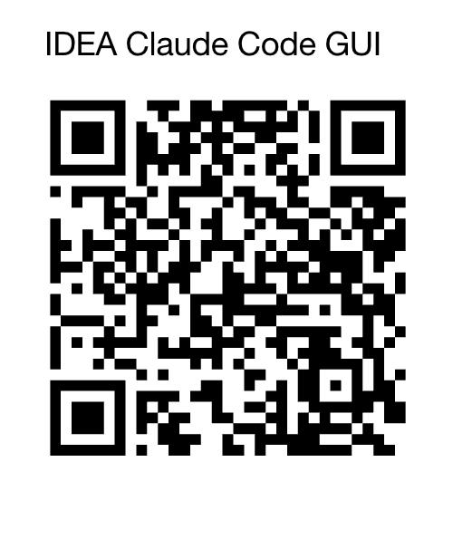

# 赞助者列表 / Sponsors List

<table>
  <tr>
    <td align="center">
      
       
      <b>Alipay</b>
    </td>
    <td align="center">
      
       
      <b>WeChat</b>
    </td>
    <td align="center">
      
       
      <b>PayPal</b>
    </td>
  </tr>
</table>

---

感谢以下赞助者的支持 ❤️

Thanks to the following sponsors for their support ❤️

<!-- SPONSORS:START -->
| 名称 | 金额 | 日期 |
|------|------|------|
| Overseas Donations | $23.60 | - |
| *笑 | ¥20 | 2026.4.10 |
| *痕 | ¥5 | 2026.4.10 |
| n*l | ¥2 | 2026.4.9 |
| *态 | ¥30 | 2026.4.9 |
| l | ¥50 | 2026.4.9 |
| *叉 | ¥5 | 2026.4.8 |
| *物 | ¥6.66 | 2026.4.8 |
| Z*o | ¥20 | 2026.4.8 |
| *堂 | ¥10 | 2026.4.8 |
| h*h | ¥1 | 2026.4.8 |
| **阳 | ¥10 | 2026.4.7 |
| *羁 | ¥20 | 2026.4.7 |
| *— | ¥100 | 2026.4.7 |
| *、 | ¥20 | 2026.4.7 |
| *瑞 | ¥9.9 | 2026.4.2 |
| D** | ¥50 | 2026.4.1 |
| 陈*r | ¥6.66 | 2026.4.1 |
| *真 | ¥10 | 2026.4.1 |
| * | ¥10 | 2026.3.30 |
| *盼 | ¥18.8 | 2026.3.30 |
| *何 | ¥5 | 2026.3.27 |
| *尘 | ¥39.9 | 2026.3.26 |
| E*n | ¥5 | 2026.3.26 |
| E*n | ¥88 | 2026.3.26 |
| *雄 | ¥50 | 2026.3.19 |
| **龙 | ¥6.66 | 2026.3.19 |
| *— | ¥50 | 2026.3.19 |
| 阳 | ¥20 | 2026.3.19 |
| 黄* | ¥5 | 2026.3.18 |
| *渔 | ¥8 | 2026.3.18 |
| d*n | ¥50 | 2026.3.17 |
| Re* | ¥520 | 2026.3.17 |
| *年 | ¥10 | 2026.3.17 |
| L*n | ¥5 | 2026.3.16 |
| *卫 | ¥66 | 2026.3.16 |
| *里 | ¥9.9 | 2026.3.14 |
| *昆 | ¥66 | 2026.3.10 |
| n*l | ¥10 | 2026.2.23 |
| *归 | ¥50 | 2026.2.12 |
| *黑 | ¥20 | 2026.2.11 |
| x*n | ¥10 | 2026.2.11 |
| *贝 | ¥10 | 2026.2.11 |
| *云 | ¥5 | 2026.2.10 |
| H*I | ¥8.88 | 2026.2.6 |
| *黑 | ¥20 | 2026.2.4 |
| *离 | ¥28.8 | 2026.2.4 |
| i*s | ¥19.9 | 2026.2.4 |
| c*x | ¥0.01 | 2026.2.4 |
| j*n | ¥10 | 2026.2.3 |
| s*y | ¥10 | 2026.2.3 |
| **闯 | ¥8.8 | 2026.2.2 |
| 梦*i | ¥9.9 | 2026.1.30 |
| *物 | ¥10 | 2026.1.28 |
| *鸿 | ¥6 | 2026.1.27 |
| *k | ¥10 | 2026.1.27 |
| *猫 | ¥6.66 | 2026.1.27 |
| G*e | ¥20 | 2026.1.26 |
| *鹏 | ¥10 | 2026.1.26 |
| *尚 | ¥3.66 | 2026.1.25 |
| *— | ¥6.66 | 2026.1.24 |
| *飞 | ¥3 | 2026.1.24 |
| *宇 | ¥18 | 2026.1.23 |
| M*s | ¥10 | 2026.1.23 |
| I*n | ¥10 | 2026.1.23 |
| *g | ¥100 | 2026.1.23 |
| *大脚丫 | ¥5 | 2026.1.22 |
| *川 | ¥20 | 2026.1.22 |
| s*y | ¥50 | 2026.1.22 |
| *生 | ¥50 | 2026.1.22 |
| *春 | ¥15 | 2026.1.22 |
| *桑 | ¥8.88 | 2026.1.22 |
| *万 | ¥9.9 | 2026.1.22 |
<!-- SPONSORS:END -->

> 无论多少金额，我会将你添加到赞助者列表中，感谢各位的支持

> No matter the amount, I will add you to the sponsors list. Thank you for your support!
